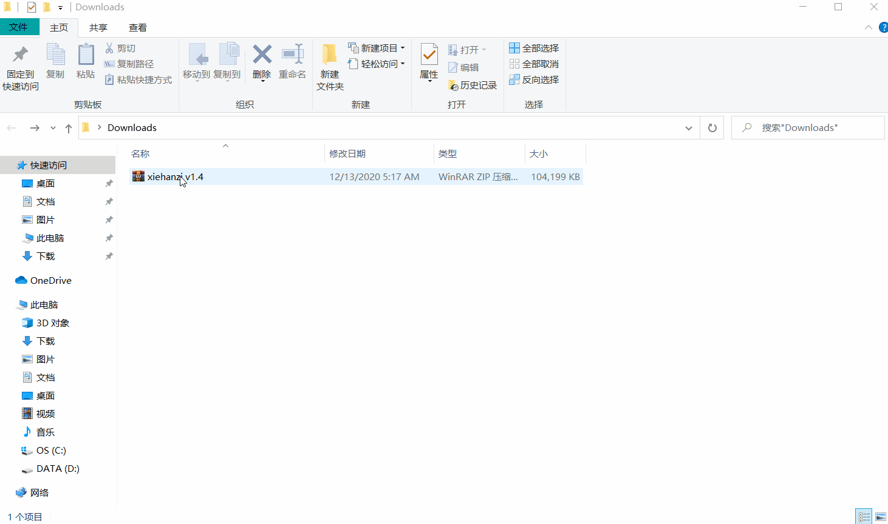
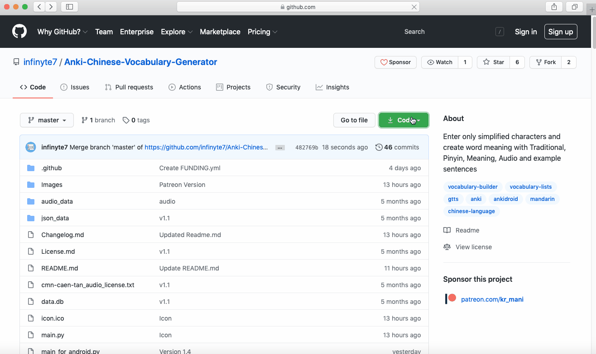
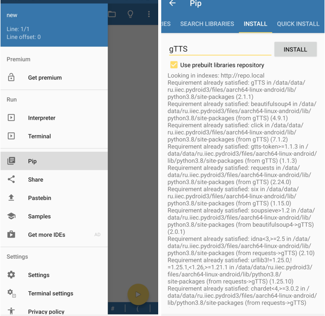

# Anki-Chinese-Vocabulary-Generator
Enter only simplified characters and create word meaning with Traditional, Pinyin, Meaning, Audio and example sentences offline.

## Demo


## Features
- Generate word list from imported file
- Traditional, Pinyin, Meaning and Audio generated automatically
- Offline fetch meaning from ```data``` folder. (cedict)
- Fetch sentences from ```data.db``` offline 
- Fetch meaning using Google translate when not found in cedict
- Save audio file in using [gTTS](https://gtts.readthedocs.io/) or [DeepHorizons/tts](https://github.com/DeepHorizons/tts)
- Save list to text file, can be imported to Anki
- Edit / Delete 

# Quick start (Windows)
 1. Install Python 
 <br>[https://www.python.org](https://www.python.org/)
 2. Download this repository 
 <br>https://github.com/infinyte7/Anki-Chinese-Vocabulary-Generator/archive/master.zip
 3. Install git
<br>https://git-scm.com/
 4. Install required library in ```requirements.txt```
 To install
```
pip install -r requirements.txt
```
```requirements.txt``` file contains following
```
jieba
gTTS
pinyin
pycedict
hanziconv
googletrans
git+https://github.com/DeepHorizons/tts
```
Install latest version ```googletrans==4.0.0rc1```.

5. Run ```main.py``` and start adding words

## Download Standalone windows program from Patreon. No need to install anything. 
Just download, extract, run and start creating word lists. <br>
**Download Now** <br>
https://www.patreon.com/kr_mani

## Demo


# To run on linux
Download this repository and then follow the steps:
1. Install python3 <br>[https://www.python.org](https://www.python.org/)
2. Download this repository 
 <br>https://github.com/infinyte7/Anki-Chinese-Vocabulary-Generator/archive/master.zip
3. Install pip3
```
python3-pip
```
4. Install following dependencies
```
jieba
gTTS
pinyin
pycedict
hanziconv
googletrans==4.0.0rc1
```
Command to install
```
python3 -m pip install -r requirements_linux.txt
```
5. Run ```main_for_linux.py```
```
python3 main_for_linux.py
```

# To run on mac
Download this repository and then follow the steps:
1. Install python3 <br>[https://www.python.org](https://www.python.org/)
2. Download this repository 
 <br>https://github.com/infinyte7/Anki-Chinese-Vocabulary-Generator/archive/master.zip

3. Install following dependencies
```
jieba
gTTS
pinyin
pycedict
hanziconv
googletrans==4.0.0rc1
```
Command to install
```
pip3 install -r requirements_mac.txt
```
5. Run ```main_for_mac.py```
```
python3 main_for_mac.py
```

### Demo


## To run on Android using Pydroid 3
1. Install [Pydroid 3](https://play.google.com/store/apps/details?id=ru.iiec.pydroid3) from play store
2. Download this repository 
 <br>https://github.com/infinyte7/Anki-Chinese-Vocabulary-Generator/archive/master.zip
3. Install following using Pip inside Pydroid 3. It requires [Pydroid repository plugin](https://play.google.com/store/apps/details?id=ru.iiec.pydroid3.quickinstallrepo) also.
```
jieba
gTTS
pinyin
pycedict
hanziconv
googletrans==4.0.0rc1
```
4. Download this keyboard [搜狗输入法 sōugǒu shūrù fǎ sogou Input](https://play.google.com/store/apps/details?id=com.sohu.inputmethod.sogou) from play store
<br/>**Note: Other keyboard will not help in typing chinese characters** 
5. Open the ```main_for_android.py``` inside Pydroid 3
6. Run the script and start adding words

#### Image
</img>

### Demo
</img>

# Note
Languages & voices for [DeepHorizons/tts](https://github.com/DeepHorizons/tts) may be needed to install for windows.


# Data
### Dictionary
The ```json_data``` folder contains dictionary data of CC-CEDICT converted to individual ```.json``` file using [cedict-json](https://github.com/infinyte7/cedict-json).
<br>[CC-CEDICT](https://www.mdbg.net/chinese/dictionary?page=cedict)

### Sentences
The ```data.db``` contains sentences downloaded from https://tatoeba.org/eng/downloads. For accessing sentences matching the words offline.

### Audio
The ```audio_data``` folder contains audio taken from https://github.com/hugolpz/audio-cmn. <br>Those audio taken from http://shtooka.net/download.php

# Import in Anki 
Use Anki Desktop to import it for [Anki-xiehanzi](https://github.com/infinyte7/Anki-xiehanzi)
1. Copy audio from ```xiehanzi``` folder to ```collection.media``` folder in Anki
2. Create a new deck
3. Import generated ```xiehanzi.txt``` file
4. Select ```Fields separated by: Tabs```
5. Map the fields to respective fields 
6. Then import


# Changelog
[Changelog.md](Changelog.md)

# Contribute
Code optimization will be appreciated.

# Todo 
- Stop freezing when translating the sentences

# License
Read [License.md](/License.md)

# Support this project on Patreon
https://www.patreon.com/kr_mani
